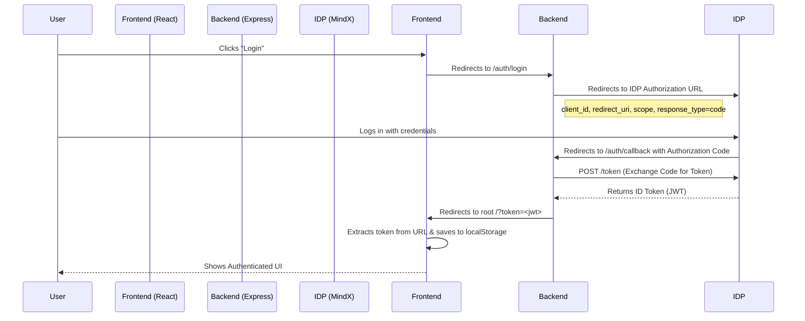

# Setup, Deployment, and Authentication Guide

This document provides detailed instructions for setting up, deploying, and understanding the authentication mechanism of the application, fulfilling the Week 1 requirements.

## 1. Setup and Local Development

### Prerequisites
- Node.js (v18+)
- Docker & Docker Compose (optional for local container testing)
- Azure CLI (for deployment)

### Environment Variables
Both Frontend and Backend require environment variables to function correctly.

**Backend (`backend/.env`):**
```env
PORT=3000
# MindX IDP Configuration
OPENID_ISSUER=https://id-dev.mindx.edu.vn
OPENID_CLIENT_ID=<YOUR_CLIENT_ID>
OPENID_CLIENT_SECRET=<YOUR_CLIENT_SECRET>
OPENID_REDIRECT_URI=http://localhost:3000/auth/callback
# Optional: Static JWT Secret for testing
JWT_SECRET=supersecretkey
```

**Frontend (`frontend/.env.development`):**
```env
VITE_API_URL=http://localhost:3000
```

### Running Locally
1.  **Backend:**
    ```bash
    cd backend
    npm install
    npm run dev
    ```
    Runs on `http://localhost:3000`.

2.  **Frontend:**
    ```bash
    cd frontend
    npm install
    npm run dev
    ```
    Runs on `http://localhost:5173`.

---

## 2. Deployment

The application is deployed to Azure Kubernetes Service (AKS) using the following architecture:
- **Backend Service:** Node.js Express API.
- **Frontend Service:** React SPA (served via Nginx or static server).
- **Ingress Controller:** Nginx Ingress handling SSL termination and path-based routing.
- **Cert Manager:** Automates Let's Encrypt certificate renewal.

### Deployment Process
1.  **Build & Push Docker Images:**
    Running the build command (via `docker build`) and pushing to Azure Container Registry (ACR).
    ```bash
    docker push <acr_name>.azurecr.io/backend:<tag>
    docker push <acr_name>.azurecr.io/frontend:<tag>
    ```

2.  **Apply Kubernetes Manifests:**
    Updates the cluster state to match the configuration in `/k8s`.
    ```bash
    kubectl apply -f k8s/app-ingress.yaml
    kubectl apply -f k8s/backend-deployment.yaml
    kubectl apply -f k8s/frontend-deployment.yaml
    ```

---

## 3. Authentication Flow (Detailed)

The application implements **OpenID Connect (OIDC)** authentication using the Authorization Code Flow. This ensures secure user identity verification via the MindX Identity Provider.

### High-Level Flow Diagram



### Detailed Steps

1.  **Login Initiation:**
    - The user clicks the login button on the Frontend.
    - The Frontend directs the user to the Backend endpoint: `GET /auth/login`.

2.  **IDP Redirection:**
    - The Backend constructs a standardized OIDC Authorization URL pointing to `https://id-dev.mindx.edu.vn/auth`.
    - Parameters include your specific `client_id`, the `redirect_uri` (e.g., `.../auth/callback`), and requested scopes (`openid profile email`).
    - The user is redirected to this URL to enter their credentials.

3.  **Authorization Callback:**
    - Upon successful login, the IDP calls the registered `redirect_uri` on the Backend (`GET /auth/callback`) and appends an authorization `code`.

4.  **Token Exchange:**
    - The Backend captures the `code` and makes a secure server-to-server POST request to the IDP's token endpoint.
    - It exchanges the `code`, `client_id`, and `client_secret` for an **ID Token** (JWT).

5.  **Session Establishment:**
    - The Backend redirects the user back to the Frontend application.
    - **Crucial Step:** The JWT is appended as a query parameter (e.g., `https://myapp.com/?token=xyz...`).
    - The Frontend detects this parameter, saves it to `localStorage`, cleans the URL, and updates the application state to "Authenticated".

### Request Validation (Backend)

For subsequent requests to protected API endpoints, the Frontend attaches the token in the `Authorization` header:
`Authorization: Bearer <token>`

The Backend validates this token using **JWKS (JSON Web Key Set)** strategy:
1.  It extracts the `kid` (Key ID) from the JWT header.
2.  It retrieves the public signing key from the IDP's JWKS endpoint (`https://id-dev.mindx.edu.vn/jwks`).
3.  It verifies the signature of the token using RSA-SHA256.
4.  If valid, the request proceeds; otherwise, a 401 Unauthorized error is returned.
