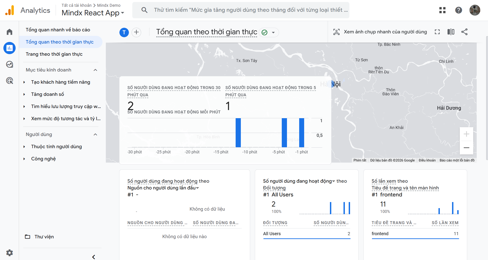

# Week 2: Observability & Monitoring Guide

This document details the layout and configuration of the observability stack implemented for the MindX Onboarding Project.

## 1. Product Metrics (Frontend)
**Tool:** Google Analytics 4 (GA4)

### Purpose
To track user engagement, session duration, and specific interactions (Login/Logout) within the React Single Page Application.

### Implementation
- **Library:** `react-ga4`
- **Initialization:** `src/main.tsx`
- **Environment Variable:** `VITE_GA_MEASUREMENT_ID` (Required in `.env`)

### Key Metrics Tracked
| Metric | Type | Trigger |
| :--- | :--- | :--- |
| **Page View** | Automatic | Tracks every route change or page load. |
| **Click Login Button** | Custom Event | User clicks "Login with MindX ID".   `Category: Auth` |
| **Click Logout Button** | Custom Event | User clicks "Logout" in the nav bar.   `Category: Auth` |

### How to Access Dashboard
1.  Go to [analytics.google.com](https://analytics.google.com/)
2.  Select your property (e.g., `MindX Onboarding App`).
3.  Navigate to **Reports** -> **Realtime** to see live user activity.

*Figure 1: Example of GA4 Realtime Dashboard showing active users and event counts.*

### How to Verify
1.  Open the application with the console open.
2.  Verify `GA Initialized with ID: ...` message on startup.
3.  Trigger an event (e.g., click "Login") and check the Realtime dashboard to see the event appear.

---

## 2. Production Metrics (Backend)
**Tool:** Azure Application Insights

### Purpose
To monitor backend API health, request latency, failure rates, and server-side exceptions.

### Implementation
- **Library:** `applicationinsights` (Official Node.js SDK)
- **Initialization:** `src/index.ts` (Must run before other imports)
- **Environment Variable:** `APPINSIGHTS_CONNECTION_STRING` (Required in `.env` or App Service Settings)

### Key Telemetry
- **Request Rate:** Number of incoming requests per second.
- **Response Time:** Average latency of API responses.
- **Failure Rate:** Percentage of 5xx errors or crashed processes.
- **Exceptions:** Stack traces of unhandled errors.

### How to Access Dashboard
1.  Log in to [portal.azure.com](https://portal.azure.com/).
2.  Search for and select your **Application Insights** resource (e.g., `Backend-Metrics`).
3.  By default, the **Overview** blade shows key metrics. You can also click **Live Metrics** under *Investigate* for real-time data.

*Figure 2: Example of Azure Application Insights Dashboard (Overview or Live Metrics).*

### How to Verify
1.  Navigate to the **Application Insights** resource in Azure Portal.
2.  Check the **Overview** charts or open **Live Metrics** to see usage data.
3.  Go to **Transaction Search** to query for specific request logs or exceptions.

---

## 3. Alerts Configuration
**Platform:** Azure Monitor

### Recommended Alert Rules
To ensure high availability, the following alerts are recommended:

#### Alert 1: High Failure Rate
- **Signal:** Failed Requests
- **Condition:** Greater than 5% over 5 minutes.
- **Action Group:** Email Admin Team.
- **Severity:** Sev1 (Critical)

#### Alert 2: High Latency
- **Signal:** Server Response Time
- **Condition:** Average > 1s over 5 minutes.
- **Action Group:** Email Dev Team.
- **Severity:** Sev3 (Warning)
